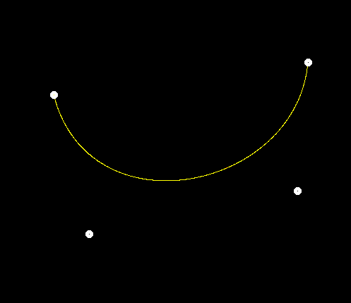

## Usage

```shell
mkdir build
cd build
cmake ..
make
./Rasterizer output.png normal
```

Change the macro `CONTROL_POINTS_NUM` to control the number of the points 
you need to control the curves.  
Notice: any non-4 points number won't get a yellow curve, which is because
the function `naive_bezier` only offer a 4-number points Bézier curves algorithm.

## Output

